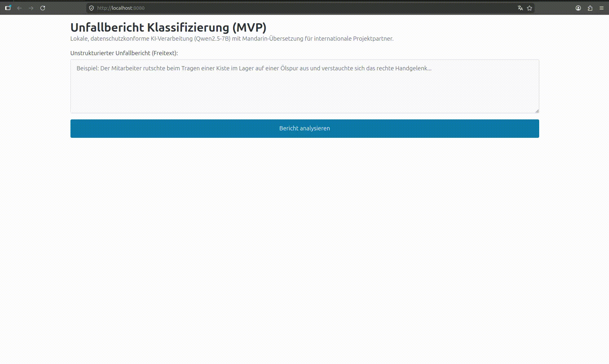

# Workplace Accident Classifier (Local AI)

A proof-of-concept AI classification tool designed for the automated extraction and coding of workplace accident scenarios from unstructured free text.



A proof-of-concept AI classification tool designed for the automated extraction and coding of workplace accident scenarios from unstructured free text.

## Project Rationale

The goal of this prototype is to automate the extraction of structured data from unstructured incident reports, while simultaneously facilitating multilingual documentation to support international collaboration.

### Architectural Decisions:
1. **Absolute Data Privacy (Offline Execution):** Processing highly sensitive medical and insurance data requires strict data sovereignty. Relying on public cloud APIs (like OpenAI or Anthropic) introduces unacceptable data leakage risks. This application is designed to run **100% locally and offline**. No text ever leaves the host machine.
2. **Multilingual Native (Qwen2.5):** The model selected for this local inference is `Qwen2.5`. It was chosen specifically for its exceptional native proficiency in multiple languages (including English and Mandarin), seamlessly translating technical root-cause summaries to support cross-border stakeholders without requiring a secondary translation API.
3. **High-Performance & Lightweight:** The backend is written in standard library Go. It requires no heavy web frameworks, ensuring a tiny memory footprint and rapid execution.

## Tech Stack

* **Backend:** Go (Standard Library `net/http`)
* **Frontend:** Vanilla HTML5, JS, and Pico.css (for a clean, dependency-free responsive UI)
* **AI Engine:** Ollama (serving as a local REST API)
* **LLM:** `qwen2.5:7b` (optimized for local VRAM / CPU execution)

## Core Features

* **Zero-Shot Extraction:** Transforms messy, unstructured free-text into strict JSON.
* **Automated Categorization:** Identifies the accident category, injured body part, and severity level.
* **Multilingual Reporting:** Automatically generates a concise 1-sentence technical summary in both English and Simplified Mandarin (zh-CN) for standardized documentation.

## How to Run Locally

### Prerequisites
* [Go](https://golang.org/dl/) installed (1.20+)
* [Ollama](https://ollama.com/) installed and running locally

### 1. Prepare the AI Engine
Pull the required model into your local Ollama instance:
```bash
ollama run qwen2.5
```
*(Note for AMD Integrated GPU users: If you experience driver issues, force Vulkan execution by starting the Ollama server with `OLLAMA_VULKAN=1 ollama serve`)*

### 2. Start the Backend Server
Clone this repository, navigate to the folder, and run the Go server:
```bash
go run main.go
```

### 3. Use the Application
Open your browser and navigate to:
```text
http://localhost:8080
```
Paste an incident report into the text box and click the analyze button. 

## Example Test Data

You can use the following unstructured text to test the system:

> *"Der Mitarbeiter ist in der Lagerhalle beim Tragen einer Europalette auf einer nicht markierten Ölspur ausgerutscht und hat sich den rechten Knöchel stark verstaucht."*

**Expected JSON Output:**
```json
{
  "category": "Sturz",
  "body_part": "Rechter Knöchel",
  "severity": "Mittel",
  "summary_en": "The employee slipped on an unmarked oil slick while carrying a pallet in the warehouse, resulting in a severely sprained right ankle.",
  "summary_zh": "该员工在仓库搬运托盘时在未标记的油迹上滑倒，导致右脚踝严重扭伤。"
}
```

---
